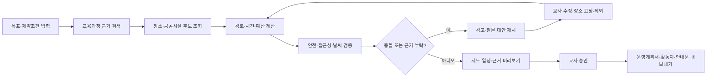

# 수업로 AI — AI 체험학습 코디네이터 제품 요구사항 정의서

## 1. 문서 정보

| 항목            | 내용                                                        |
| --------------- | ----------------------------------------------------------- |
| 제품명          | 수업로 AI(SueopRo AI)                                       |
| 첫 서비스       | AI 체험학습 코디네이터                                      |
| 저장소 식별자   | `sueop-ro`                                                  |
| 문서 버전       | 0.2                                                         |
| 상태            | fixture-first 로컬 MVP 검증 완료, 외부 활성화 게이트 대기   |
| 기준일          | 2026-07-13                                                  |
| 제품 책임자     | 이수미 교수                                                 |
| 1차 사용자      | 초·중·고 교사, 교원연수 참여자, 교육 프로그램 운영자        |
| 1차 서비스 범위 | 대한민국 국내 당일형 체험학습                               |
| 1차 실행 환경   | Windows 11과 Apple Silicon macOS에서 실행되는 반응형 웹/PWA |
| 대표 시연 시간  | 3분 이내                                                    |

> 이 문서는 제품·교육·기술 요구사항의 기준 문서다. 지도·공공데이터의 이용정책과 위치정보 관련 의무는 공개 범위와 데이터 처리 방식이 확정되는 시점에 최신 기준으로 다시 검토한다.

---

## 2. 의사결정 요약

### 2.1 제품 한 문장 정의

수업로 AI의 첫 서비스인 AI 체험학습 코디네이터는 교사가 학년·교과·성취기준·출발지·일정·인원·예산·안전·접근성 조건을 입력하면, 대한민국 공간정보와 교육 데이터를 근거로 실행 가능한 체험학습 일정과 수업 문서를 생성하고 지도에서 검토하게 하는 사람 승인형 에이전트 서비스다.

### 2.2 MVP 승인 기본값

| 항목          | 승인값                                                                                                  |
| ------------- | ------------------------------------------------------------------------------------------------------- |
| 대표 시나리오 | 중학교 2학년 과학 생태계 단원 당일 체험학습                                                             |
| 대표 입력     | 출발지, 날짜·시간, 30명, 1인 예산, 대중교통 또는 전세버스, 휠체어 접근 필요, 우천 대안                  |
| 대표 출력     | 지도, 시간표, 이동구간, 예산 추정, 안전·접근성 경고, 교사용 운영계획서, 학생 활동지, 보호자 안내문 초안 |
| 지도 공급자   | Kakao Maps 우선 구현, 공급자 어댑터로 교체 가능하게 설계                                                |
| 데이터 운영   | 라이브 API와 검증된 샘플 데이터 이중 모드                                                               |
| 에이전트 방식 | 결정적 워크플로 + 구조화 도구 호출 + 사람 승인                                                          |
| 계획 확정     | 교사가 경고와 근거를 검토하고 명시적으로 승인한 경우에만 확정                                           |
| 개인정보      | 학생 명단·건강정보·실시간 위치를 수집하지 않고 인원과 집계 요구만 입력                                  |
| 예약·결제     | MVP에서 실행하지 않고 공식 페이지 링크와 확인 필요 상태만 제공                                          |
| 초기 저장     | 로컬·데모 모드 중심, 계정·다기관 구조는 후속 단계                                                       |
| 배포          | Node 기반 크로스플랫폼 실행, Docker 필수 아님                                                           |

### 2.3 성공한 지도 서비스에서 가져올 원칙

1. 지도는 배경이 아니라 장소·경로·결정·행동을 연결하는 작업공간이어야 한다.
2. AI는 장소를 나열하는 대신 사용자의 제약조건을 검증하고 추천 근거를 설명해야 한다.
3. 장소·운영시간·경로·가격·안전 정보에는 출처와 조회 시각이 있어야 한다.
4. 추천 결과는 교사가 수정·제외·고정한 뒤 다시 계산할 수 있어야 한다.
5. 실제 예약·안전 판단·학교 결재를 AI가 완료했다고 표현하지 않는다.

---

## 3. 배경과 문제 정의

### 3.1 현재 문제

교사는 체험학습 한 건을 설계하기 위해 다음 정보를 서로 다른 웹사이트와 문서에서 확인한다.

- 교육과정 성취기준과 수업 목표
- 체험 장소의 교육적 가치와 프로그램 운영 여부
- 출발지에서 각 장소까지의 이동시간과 환승
- 운영시간, 휴관일, 단체 수용 여부와 예약 필요 여부
- 학생 수와 교통수단에 따른 비용
- 식사, 화장실, 대피시설, 응급대응 시설
- 휠체어·보행·감각 접근성
- 날씨·대기질·우천 시 대체 장소
- 학교 내부 검토용 운영계획서와 보호자 안내문

이 과정은 반복 작업이 많지만 단순 검색 자동화로 해결되지 않는다. 장소가 좋아도 이동시간이나 운영시간을 위반하면 실행할 수 없고, 교육적으로 타당해도 안전과 접근성 근거가 부족하면 학교 계획으로 사용할 수 없기 때문이다.

### 3.2 해결하려는 핵심 문제

교사가 하나의 화면에서 다음 질문에 답할 수 있어야 한다.

- 이 장소가 어떤 교육과정 목표와 연결되는가?
- 주어진 시간과 예산 안에서 실제 방문 가능한가?
- 이동·식사·휴식·관람 순서가 학생 집단에 적절한가?
- 확인되지 않은 운영시간·가격·접근성 정보는 무엇인가?
- 비·미세먼지·교통 장애가 발생하면 어떤 대안이 있는가?
- 계획의 각 판단은 어느 자료를 근거로 했는가?
- 학교 양식에 옮길 수 있는 문서 초안을 바로 얻을 수 있는가?

### 3.3 제품 가설

교육과정 근거, 국내 장소 데이터, 경로 계산, 안전·접근성 검증을 구조화된 도구로 연결하고 에이전트가 이를 순서대로 실행하면 교사의 초안 작성 시간을 줄이면서도 근거와 사람 통제를 유지할 수 있다.

---

## 4. 목표와 비목표

### 4.1 MVP 목표

- 교사가 5분 이내에 검토 가능한 체험학습 초안을 만든다.
- 장소와 활동마다 교육과정 연결 근거를 제공한다.
- 운영시간, 이동시간, 체류시간, 예산의 충돌을 자동으로 감지한다.
- 안전·접근성·날씨 정보가 없으면 추정하지 않고 확인 필요로 표시한다.
- 라이브 API 장애 중에도 검증된 샘플 시나리오로 3분 데모를 완주한다.
- 결과를 지도와 문서로 동시에 제공한다.
- 에이전트의 도구 호출과 출처를 연구·수업용 평가자료로 남긴다.

### 4.2 MVP 비목표

- 숙박형·해외 체험학습
- 실제 예약, 결제, 환불, 차량 배차
- 학교 전자결재·NEIS 기록 자동 반영
- 학생 명단, 연락처, 건강·장애 상세정보 수집
- 학생 또는 인솔자의 실시간 위치추적
- 안전성을 보증하거나 교사의 법적·행정적 책임을 대체하는 기능
- 완전 자율 에이전트가 사용자 승인 없이 계획을 확정·전송하는 기능
- 모든 교과·학년 성취기준을 초기부터 완전 자동 수집하는 기능
- 네이티브 iOS·Android 앱

---

## 5. 사용자와 핵심 과업

### 5.1 주요 사용자

| 사용자               | 필요                                | 성공 기준                                    |
| -------------------- | ----------------------------------- | -------------------------------------------- |
| 담임·교과 교사       | 수업 목표와 연결된 실행 가능한 일정 | 계획 초안을 5분 안에 만들고 근거를 확인함    |
| 교육 프로그램 운영자 | 여러 학급·과정에 재사용할 일정      | 조건을 바꾸어 대안을 빠르게 생성함           |
| 교원연수 참여자      | 에이전트와 지도 API를 학습할 사례   | 입력→도구호출→검증→문서화 전 과정을 관찰함   |
| 관리자·연구자        | 에이전트 품질과 오류를 분석할 증거  | 도구 성공률, 제약 충족률, 출처 누락을 평가함 |

### 5.2 핵심 사용자 과업

1. 체험학습 목표와 필수 조건을 입력한다.
2. 추천 장소와 교육과정 연결 근거를 비교한다.
3. 지도와 일정표에서 장소 순서와 이동구간을 확인한다.
4. 시간·예산·안전·접근성 경고를 해결한다.
5. 장소를 고정하거나 제외하고 대안을 다시 생성한다.
6. 최종 초안을 승인한다.
7. 교사용·학생용·보호자용 문서를 내보낸다.

---

## 6. 핵심 사용자 흐름

### 6.1 계획 상태

| 상태                 | 의미                                   |
| -------------------- | -------------------------------------- |
| `DRAFT`              | 입력 또는 장소 선택을 수정 중          |
| `GATHERING`          | 외부 데이터와 교육과정 근거를 수집 중  |
| `VALIDATING`         | 일정·예산·안전·접근성 제약을 검증 중   |
| `NEEDS_REVIEW`       | 경고·근거 누락·사용자 선택이 남아 있음 |
| `READY_FOR_APPROVAL` | 필수 검증을 통과하고 승인 대기 중      |
| `APPROVED`           | 교사가 명시적으로 승인함               |
| `ARCHIVED`           | 더 이상 편집하지 않는 이전 계획        |

---

## 7. MVP 기능 범위

### 7.1 계획 입력

- 학교급, 학년, 교과, 단원 또는 성취기준
- 학습목표와 기대 산출물
- 출발지와 귀착지
- 날짜, 출발·도착 가능 시간
- 학생 수와 인솔자 수의 집계값
- 총예산 또는 1인당 예산
- 교통수단과 최대 이동시간
- 필수 장소 유형과 제외 조건
- 식사, 휴식, 화장실 요구
- 휠체어·계단 회피 등 집계 접근성 요구
- 우천·폭염·미세먼지 대안 필요 여부

### 7.2 장소 탐색과 비교

- 키워드·카테고리·반경 기반 장소검색
- 관광·박물관·과학관·생태·산업체험·공공시설 후보
- 주소, 좌표, 운영시간, 전화, 공식 링크, 예약 필요 여부
- 교육적 적합성, 이동 적합성, 비용 근거, 안전·접근성 근거를 분리 표시
- 지도 마커와 결과 카드의 양방향 선택
- 장소 고정, 제외, 대체 요청

### 7.3 일정·예산 계산

- 장소별 권장 체류시간
- 이동구간별 교통수단, 거리, 예상시간, 출처
- 운영시간과 도착시간 충돌 감지
- 점심·휴식·집결·안전교육 버퍼 반영
- 알려진 비용과 추정 비용 분리
- 1인당·총비용 계산과 예산 초과 경고
- 비용이 확인되지 않은 항목을 0원으로 처리하지 않고 확인 필요로 표시

### 7.4 안전·접근성·대안

- 날씨·대기질 데이터와 조회 시각
- 가까운 대피시설·응급시설 등 공공정보
- 접근성 정보의 출처와 확인 상태
- 우천 또는 야외활동 불가 시 실내 대체 장소
- API 장애나 정보 부족 시 실패를 숨기지 않는 경고
- 학교·기관 공식 확인이 필요한 체크리스트

### 7.5 문서 생성

- 교사용 체험학습 운영계획서 초안
- 학생용 사전·현장·사후 활동지
- 보호자 안내문 초안
- 지도와 장소별 공식 링크
- Markdown 내보내기와 인쇄용 HTML/PDF
- 생성 시각, 데이터 조회 시각, 미확인 항목, 면책 문구

---

## 8. 기능 요구사항

### 8.1 계획 작업공간

- **FR-PLAN-001** 시스템은 필수 입력이 누락된 상태에서 외부 검색을 시작하지 않고 누락 항목을 표시해야 한다.
- **FR-PLAN-002** 사용자는 장소를 고정·제외한 뒤 나머지 일정만 다시 계산할 수 있어야 한다.
- **FR-PLAN-003** 시스템은 각 계획의 상태, 수정 시각, 승인 시각을 기록해야 한다.
- **FR-PLAN-004** 승인 후 계획이 수정되면 승인 상태를 해제하고 재검증을 요구해야 한다.

### 8.2 교육과정 근거

- **FR-CURR-001** 사용자는 학교급·학년·교과·교육과정 버전을 명시적으로 선택할 수 있어야 한다.
- **FR-CURR-002** 장소와 활동 추천에는 연결된 성취기준 또는 사용자가 입력한 학습목표가 표시되어야 한다.
- **FR-CURR-003** 시스템은 원문 근거와 AI가 작성한 해설을 시각적으로 구분해야 한다.
- **FR-CURR-004** 근거가 없는 활동은 성취기준과 연결됐다고 단정하지 않아야 한다.

### 8.3 장소와 경로

- **FR-GEO-001** 장소 결과는 이름, 좌표, 주소, 유형, 출처, 조회 시각을 포함해야 한다.
- **FR-GEO-002** 경로 결과는 출발·도착, 교통수단, 거리, 예상시간, 공급자를 포함해야 한다.
- **FR-GEO-003** 지도 마커와 일정 항목은 동일 장소 식별자로 동기화되어야 한다.
- **FR-GEO-004** 공급자 장애 시 캐시 또는 샘플 모드 사용 여부를 명확하게 표시해야 한다.

### 8.4 제약조건 검증

- **FR-CNST-001** 모든 일정 구간은 선행 장소 종료, 이동시간, 버퍼 이후에 시작되어야 한다.
- **FR-CNST-002** 장소 도착·체류시간이 확인된 운영시간을 벗어나면 승인 준비 상태로 전환할 수 없어야 한다.
- **FR-CNST-003** 비용은 확정·추정·미확인으로 구분하고 예산 계산 근거를 표시해야 한다.
- **FR-CNST-004** 사용자 필수 조건과 선호 조건을 구분해 충돌 시 필수 조건을 우선해야 한다.

### 8.5 에이전트 통제와 근거

- **FR-AGT-001** 에이전트는 승인된 도구 목록만 호출하고 구조화된 인수를 사용해야 한다.
- **FR-AGT-002** 모든 외부 사실에는 출처 또는 미확인 상태가 있어야 한다.
- **FR-AGT-003** 도구 호출 실패를 성공 결과처럼 요약하지 않아야 한다.
- **FR-AGT-004** 사용자 승인 전 예약·결제·대외 전송을 실행하지 않아야 한다.
- **FR-AGT-005** 계획 생성 결과에는 가정, 경고, 누락 정보를 별도 영역으로 표시해야 한다.

### 8.6 개인정보와 운영

- **FR-PRIV-001** MVP는 학생 이름, 연락처, 건강·장애 상세정보를 요구하거나 저장하지 않아야 한다.
- **FR-PRIV-002** 출발지는 사용자가 직접 입력하며 연속 위치추적을 사용하지 않아야 한다.
- **FR-PRIV-003** API 키와 모델 키는 서버 비밀정보로 관리하고 브라우저 번들·로그·내보내기 문서에 포함하지 않아야 한다.
- **FR-OPS-001** 라이브 API 없이도 검증된 샘플 데이터로 전체 데모를 수행할 수 있어야 한다.
- **FR-OPS-002** 라이브·캐시·샘플 데이터는 화면과 로그에서 구분되어야 한다.

---

## 9. 에이전트 설계 원칙

### 9.1 에이전트 실행 단계

1. `intake.validate`: 필수 입력과 모호한 조건 확인
2. `curriculum.retrieve`: 교육과정 근거 조회
3. `places.search`: 장소 후보와 공식 정보 수집
4. `routes.matrix`: 후보 간 이동시간 행렬 생성
5. `itinerary.solve`: 시간·예산·선호 제약을 반영한 일정 생성
6. `safety.check`: 날씨·대기질·안전·접근성 확인
7. `plan.verify`: 위반, 누락, 오래된 자료 검사
8. `plan.explain`: 추천 이유와 대안 설명
9. `human.approve`: 교사가 수정·승인
10. `documents.render`: 승인된 계획을 문서로 변환

### 9.2 도구 호출 기본 규칙

- 자유문장 결과보다 JSON Schema로 검증되는 구조화 응답을 우선한다.
- 지도·운영시간·비용·안전 정보는 언어모델의 사전지식만으로 만들지 않는다.
- 하나의 공급자 결과를 절대적 사실로 표현하지 않고 출처와 조회 시각을 남긴다.
- 가격, 단체 수용, 예약 가능 여부가 확인되지 않으면 전화 또는 공식 페이지 확인 과제로 남긴다.
- 모델이 계획을 제안할 수는 있지만 승인 상태를 직접 변경할 수 없다.

### 9.3 사람 승인 게이트

다음 조건을 모두 만족해야 `READY_FOR_APPROVAL` 상태가 된다.

- 필수 입력이 완전함
- 모든 일정 구간의 시간이 계산됨
- 운영시간 위반이 없음
- 예산 초과가 없거나 사용자가 초과를 명시적으로 수용함
- 필수 접근성 조건의 확인 또는 확인 필요 표시가 있음
- 기상·안전 데이터 상태가 표시됨
- 장소와 경로에 출처가 있음
- 미확인 항목이 체크리스트에 포함됨

---

## 10. 데이터·API 전략

| 도메인    | 1차 후보                                        | MVP 사용                | 장애 대안                  |
| --------- | ----------------------------------------------- | ----------------------- | -------------------------- |
| 지도·장소 | Kakao Maps·Local API                            | 지도, 주소·장소검색     | 검증된 장소 fixture        |
| 경로      | Kakao 대중교통·도보·자전거 API 또는 공급자 대체 | 구간 시간·거리          | 사전 검증 경로 fixture     |
| 관광      | 한국관광공사 TourAPI                            | 관광지·시설 정보        | 캐시 스냅샷                |
| 학교      | 학교알리미·공공데이터                           | 출발 학교 기본정보 보조 | 사용자 직접 입력           |
| 기상      | 기상청 공공데이터                               | 당일·예보 상태          | 조회 실패 경고와 수동 입력 |
| 대기질    | 에어코리아·지자체 공공데이터                    | 미세먼지·오존           | 조회 실패 경고             |
| 안전시설  | 생활안전지도·공공데이터                         | 대피·응급시설 후보      | 공식 링크 안내             |
| 교육과정  | 승인된 교육과정 원문·내부 색인                  | 성취기준 검색           | 사용자 직접 입력           |

### 10.1 공급자 정책 기준

- Kakao Maps는 2026-07-21부터 대중교통·도보·자전거·정적 지도 API와 계정 기준 무료 쿼터 정책 변경이 예고되어 있으므로 활성화 앱과 비용을 구현 착수 시 재확인한다.
- 지도·공공데이터의 캐시, 재배포, 출처표시 조건을 공급자별로 기록한다.
- 공식 API 승인이 필요한 데이터는 승인 전 샘플 데이터로 개발하고 라이브 데이터처럼 표시하지 않는다.
- 외부 API 계약은 `ProviderResult<T>` 형식으로 통일하고 `source`, `retrievedAt`, `mode`, `staleAt`, `warnings`를 필수로 한다.

---

## 11. 핵심 데이터 모델

| 엔터티                | 주요 내용                                   |
| --------------------- | ------------------------------------------- |
| `TripPlan`            | 제목, 상태, 목표, 일정, 승인 정보           |
| `ConstraintSet`       | 시간, 예산, 인원, 교통, 필수·선호·제외 조건 |
| `CurriculumReference` | 교육과정 버전, 성취기준 코드·원문·출처      |
| `PlaceCandidate`      | 공급자 ID, 좌표, 공식정보, 교육·접근성 근거 |
| `ItineraryStop`       | 장소, 시작·종료, 활동, 체류시간, 고정 여부  |
| `RouteLeg`            | 출발·도착, 교통수단, 거리, 시간, 출처       |
| `CostItem`            | 단가, 수량, 확정·추정·미확인 상태, 근거     |
| `SafetyEvidence`      | 날씨, 대기질, 대피·응급·접근성 정보와 상태  |
| `SourceEvidence`      | URL·기관·조회 시각·데이터 모드·만료 시각    |
| `AgentRun`            | 단계, 모델, 상태, 시작·종료, 평가 결과      |
| `ToolCall`            | 도구명, 인수 해시, 결과 상태, 지연, 오류    |
| `DocumentArtifact`    | 문서 유형, 계획 버전, 생성 시각, 형식       |

---

## 12. 비기능 요구사항

### 12.1 호환성과 사용성

- **NFR-COMPAT-001** Chrome·Edge 최신 안정 버전에서 Windows 11과 Apple Silicon macOS 모두 실행되어야 한다.
- **NFR-COMPAT-002** 1280×720 강의실 화면과 모바일 세로 화면에서 핵심 흐름을 사용할 수 있어야 한다.
- **NFR-PORT-001** 초기 데모는 Docker 없이 Node 런타임만으로 실행할 수 있어야 한다.
- **NFR-A11Y-001** 키보드 탐색, 초점 표시, 색상 외 경고 표현, 지도 대체 목록을 제공해야 한다.

### 12.2 성능과 신뢰성

- **NFR-PERF-001** 샘플 모드에서 계획 초안은 10초 이내, 일반 화면 상호작용은 200ms 이내 반응을 목표로 한다.
- **NFR-PERF-002** 라이브 API 모드의 전체 초안 생성은 정상 네트워크에서 p95 30초 이내를 목표로 한다.
- **NFR-REL-001** 공급자 한 곳의 장애가 전체 계획 편집과 기존 계획 열람을 중단시키지 않아야 한다.
- **NFR-REL-002** 같은 요청의 재시도는 중복 계획·중복 문서를 만들지 않아야 한다.

### 12.3 보안과 추적성

- **NFR-SEC-001** 외부 입력과 도구 응답을 스키마로 검증해야 한다.
- **NFR-SEC-002** 서버 로그는 비밀정보와 전체 원문 프롬프트의 불필요한 개인정보를 제거해야 한다.
- **NFR-AUDIT-001** 계획 승인과 승인 취소는 주체·시각·계획 버전과 함께 기록해야 한다.
- **NFR-PROV-001** 내보낸 문서의 외부 사실은 출처 또는 미확인 표시를 가져야 한다.

---

## 13. 품질평가와 성공지표

### 13.1 제품 성공지표

| 지표                             | MVP 목표 |
| -------------------------------- | -------: |
| 완전한 계획 초안 작성시간 중앙값 | 5분 이하 |
| 필수 제약조건 충족률             | 95% 이상 |
| 장소·경로 출처 표시율            |     100% |
| 치명적 사실 날조                 |      0건 |
| 샘플 데모 완주율                 |     100% |
| 도구 호출 성공률                 | 95% 이상 |
| 사용자 승인 전 대외 실행         |      0건 |
| 실학생 개인정보 저장             |      0건 |

### 13.2 평가 데이터셋

최소 12개의 합성 벤치마크 계획을 유지한다.

- 학교급: 초등·중등·고등
- 지역: 수도권·광역시·비수도권
- 교통: 도보·대중교통·전세버스 가정
- 제약: 저예산·짧은 일정·우천·휠체어·미세먼지·장거리
- 실패 사례: 휴관, 운영시간 충돌, 예산 초과, 경로 API 장애, 접근성 미확인

### 13.3 연구·수업용 평가 항목

- 에이전트 계획과 규칙 기반 검증 결과의 차이
- 장소 추천 순위에 영향을 준 조건
- 도구 호출 실패 후 복구 방식
- 출처 있는 답변과 모델 일반지식 답변의 정확도 차이
- 사람 수정 전후 제약조건 충족률
- 설명 제공 여부가 교사 신뢰와 수정시간에 미치는 영향

---

## 14. 대표 인수 시나리오

### AC-001 정상 계획 생성

중학교 2학년 과학, 출발지, 09:00~15:00, 30명, 예산, 대중교통 조건을 입력하면 지도·일정·예산·교육과정 근거가 포함된 초안이 생성된다.

### AC-002 운영시간 충돌

추천 장소가 예상 도착시간에 휴관이면 계획은 승인 준비 상태가 되지 않고 대체 장소 또는 순서 변경을 제안한다.

### AC-003 예산 초과

확인된 비용과 추정 비용의 합이 예산을 넘으면 초과액과 원인을 표시하고 저비용 대안을 제시한다.

### AC-004 접근성 근거 부족

휠체어 접근이 필수인데 공식 근거가 없으면 접근 가능으로 추정하지 않고 확인 필요 경고와 공식 문의 정보를 표시한다.

### AC-005 우천 대안

야외 장소가 포함된 계획에서 우천 대안을 요구하면 실내 후보와 변경된 이동시간·예산을 함께 제시한다.

### AC-006 API 장애

경로 공급자가 실패하면 실패 사실과 사용할 수 없는 정보를 표시하며, 샘플 시나리오에서는 검증된 fixture로 전환해 데모를 완료한다.

### AC-007 사람 승인

필수 경고가 남아 있으면 승인 버튼이 차단되고, 경고가 해결된 계획만 교사가 승인할 수 있다.

### AC-008 문서 내보내기

승인된 계획에서 생성한 운영계획서·활동지·안내문에 일정, 장소, 지도 링크, 출처, 미확인 항목, 생성 시각이 포함된다.

---

## 15. 마일스톤

| 단계             | 범위                                     | 완료 증거                           | 상태      |
| ---------------- | ---------------------------------------- | ----------------------------------- | --------- |
| M0 기획 기준선   | PRD, OpenSpec 제안·명세·설계·작업목록    | OpenSpec strict validate 통과       | 완료      |
| M1 지도 작업공간 | 입력 폼, 지도, 장소검색, fixture 모드    | 데스크톱·390px 브라우저 검증        | 완료      |
| M2 일정 에이전트 | 교육과정 검색, 경로 행렬, 일정·예산 검증 | 정상·충돌·실패 자동 테스트          | 완료      |
| M3 안전·문서     | 날씨·안전·접근성, 사람 승인, 문서 출력   | 예산 차단→승인→승인본 브라우저 검증 | 완료      |
| M4 평가·배포     | 12개 벤치마크, 평가 대시보드, 배포 문서  | 12/12 평가와 로컬 빌드              | 로컬 완료 |
| M5 파생 서비스   | 캠퍼스 접근성·지역안전·교육격차 모드     | 공통 플랫폼 재사용 증거             | 후속      |

---

## 16. 위험과 대응

| 위험                          | 대응                                                           |
| ----------------------------- | -------------------------------------------------------------- |
| 외부 API 승인·쿼터·요금 변경  | 공급자 어댑터, fixture 모드, 비용 상한과 상태 대시보드         |
| 운영시간·가격 데이터의 오래됨 | 조회 시각·만료 시각 표시, 공식 확인 체크리스트                 |
| 에이전트의 사실 날조          | 외부 사실은 도구 결과만 사용, 스키마 검증, 출처 없는 문장 차단 |
| 접근성·안전의 과도한 확신     | 확인·미확인·충돌 상태 분리, 사람 승인과 면책 문구              |
| 지도 공급자 종속              | 장소·경로·표시 계층을 어댑터로 분리                            |
| 라이브 데모 네트워크 실패     | 검증된 샘플 데이터와 재현 가능한 데모 시나리오                 |
| 범위 팽창                     | 당일형·교사 중심·예약 없는 MVP 범위 유지                       |
| 개인정보 수집 유혹            | 인원과 집계 요구만 입력, 학생 명단·실시간 위치 기능 금지       |

---

## 17. 외부 활성화·공개 전 확인 항목

- [x] 작업 브랜드를 `수업로 AI(SueopRo AI)`로 확정하고 충돌 조사 기록
- [x] NCIC 2022 개정 교육과정을 초기 기준 출처로 선정하고 시연용 요약을 원문과 분리
- [x] 가상 장소와 합성 경로를 사용한 중2 과학 fixture 시나리오 구축
- [ ] 공개 전 상표·도메인·스토어 이름 최종 확인
- [ ] Kakao Maps 개발자 앱과 2026-07-21 이후 쿼터·요금 확인
- [ ] TourAPI·기상·환경·안전 데이터 키 발급 가능 여부 확인
- [ ] 대표 교육과정 원문과 성취기준 색인의 사용·출처표시 방식 확정
- [ ] 첫 공개 데모 지역과 대표 장소 5~8개 선정
- [ ] 학교 제출 문서 템플릿을 받을 수 있는지 확인
- [ ] 공개 호스팅 전 위치정보·개인정보 처리 범위 검토

## 18. 관련 문서

- [OpenSpec 제안서](../openspec/changes/build-ai-field-trip-coordinator-mvp/proposal.md)
- [기술설계](../openspec/changes/build-ai-field-trip-coordinator-mvp/design.md)
- [구현 작업 목록](../openspec/changes/build-ai-field-trip-coordinator-mvp/tasks.md)
- [검증 기록](./VALIDATION.md)
- [운영 안내](./OPERATIONS.md)
- [GitHub 게시 인수인계](./PUBLICATION_HANDOFF.md)
- [Kakao Maps API 문서](https://developers.kakao.com/docs/ko/kakaomap/common)
- [Kakao Maps 2026-07-21 정책 변경](https://devtalk.kakao.com/t/api-notice-on-new-kakao-map-api-features-and-free-quota-policy/150222)
- [NAVER 지도 API 문서](https://navermaps.github.io/maps.js.ncp/docs/)
- [학교알리미 OpenAPI](https://www.schoolinfo.go.kr/ng/go/pnnggo_a01_m0.do)
- [스마트서울맵 OpenAPI](https://map.seoul.go.kr/smgis2/openApi)
