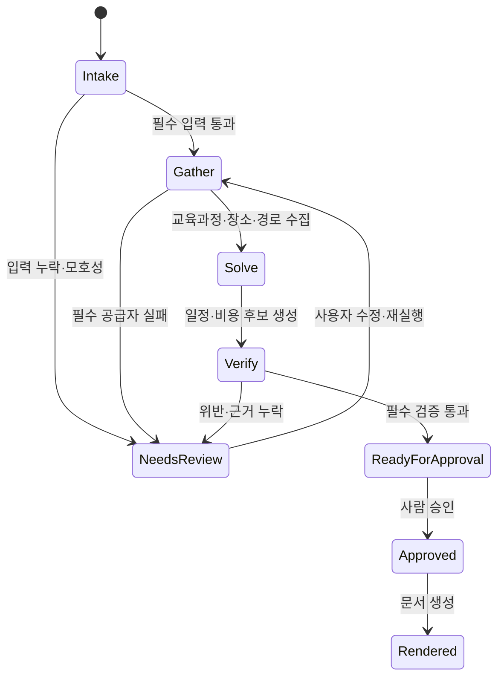

## Context

수업로 AI는 교육과정과 지리공간 데이터를 연결하는 신규 플랫폼이며, 첫 서비스는 AI 체험학습 코디네이터다. 교사가 교육과정 목표와 운영 제약을 입력하면 장소·경로·기상·안전·접근성 데이터를 수집하고, 실행 가능한 당일 체험학습 일정과 수업 문서를 생성해야 한다. 결과는 대한민국 지도에서 검토할 수 있어야 하며, 외부 사실마다 출처와 조회 시각을 남기고 사람 승인 전에는 계획을 확정하거나 외부 행동을 실행하지 않아야 한다.

외부 지도·경로·공공데이터 API는 쿼터, 승인, 응답 형식, 장애 특성이 서로 다르다. 2026-07-21 예정인 Kakao Maps API 정책 변경처럼 개발 중 계약이 바뀔 수 있으므로 특정 공급자 응답을 도메인 모델에 직접 결합하면 안 된다. 라이브 강의 시연은 네트워크와 외부 API 장애에도 완주해야 한다.

기본 이동 개발기는 Windows 11 환경이고 macOS 개발기는 Apple Silicon 기반 검증 장비다. 프로젝트는 macOS 전용 도구 없이 두 환경에서 동일하게 실행되어야 하며, 초기에는 Docker 설치 여부를 전제로 하지 않는다.

주요 이해관계자는 체험학습을 설계·승인하는 교사, 교육 프로그램 운영자, 에이전트 동작을 학습·평가하는 수강생과 연구자다.

## Goals / Non-Goals

**Goals:**

- 반응형 웹에서 입력, 지도 탐색, 일정 검증, 승인, 문서 내보내기까지 하나의 흐름으로 제공한다.
- 외부 공급자와 언어모델을 교체할 수 있는 도메인·도구 경계를 만든다.
- 언어모델은 후보 생성과 설명에 사용하고 시간·예산·상태 전이는 결정적 코드가 검증한다.
- 라이브·캐시·fixture 데이터의 출처와 신선도를 일관된 형식으로 전달한다.
- 샘플 모드에서 네트워크 없이도 대표 3분 데모와 자동화 테스트를 재현한다.
- API 키, 위치 입력, 에이전트 로그를 최소권한·최소수집 원칙으로 처리한다.
- 향후 캠퍼스 접근성, 지역안전, 교육격차 지도로 확장할 수 있는 공통 지리공간 플랫폼을 만든다.

**Non-Goals:**

- MVP에서 실제 예약·결제·메시지 발송·학교 전자결재를 수행하지 않는다.
- 학생 계정, 학생 명단, 건강·장애 세부정보, 연속 위치를 저장하지 않는다.
- 복수 기관 테넌시, 역할 기반 학사관리, 네이티브 모바일 앱을 구현하지 않는다.
- 언어모델이 규칙 검증이나 승인 상태를 임의로 우회하게 하지 않는다.
- 모든 지역·교과 데이터의 완전성을 보장하지 않는다.

## Decisions

### 1. 단일 TypeScript 애플리케이션으로 MVP를 시작한다

웹 UI와 서버 API를 하나의 현재 안정 Next.js 계열 TypeScript 프로젝트에 두고, 버전은 구현 시작 시 잠금 파일에 고정한다. 지도·에이전트·문서·평가 도메인은 모듈 경계로 분리한다.

선택 이유:

- Windows와 macOS에서 Node만으로 실행할 수 있다.
- 프런트와 서버 도구 계약을 공유 타입과 JSON Schema로 관리할 수 있다.
- 초기 배포·디버깅 경로가 단순하고 4주 MVP 일정에 적합하다.

검토한 대안:

- `Next.js + FastAPI` 분리: Python 데이터 생태계 장점은 있으나 두 런타임과 계약 중복이 초기 속도를 낮춘다. 공간분석·최적화가 복잡해질 때 후속 서비스로 분리한다.
- Flutter: 네이티브 위치 기능에는 유리하지만 강의실 웹 시연, 문서 출력, 빠른 파생 서비스 제작에는 웹이 유리하다.

### 2. 에이전트는 결정적 오케스트레이터와 제한된 도구 호출로 구현한다

에이전트 실행은 다음 상태기계로 제어한다.



언어모델은 구조화된 후보와 설명을 만들지만 다음 항목은 코드가 계산한다.

- 계획 상태 전이
- 시간 합산과 운영시간 충돌
- 이동 버퍼와 체류시간
- 확정·추정·미확인 비용 합산
- 필수 조건 충족 여부
- 승인 가능 여부

검토한 대안:

- 완전 자율 멀티에이전트: 시연 효과는 있으나 재현성, 지연, 비용, 오류 분석이 나쁘다.
- 규칙 기반만 사용: 실행 가능성 검증에는 좋지만 교육과정 연결 설명과 대안 생성이 경직된다.

### 3. 공급자 어댑터와 정규화 결과 계약을 사용한다

외부 연동은 도메인별 인터페이스로 분리한다.

```text
MapDisplayProvider
PlaceSearchProvider
RouteProvider
TourismProvider
WeatherProvider
AirQualityProvider
SafetyFacilityProvider
CurriculumProvider
ModelProvider
```

모든 공급자 결과는 다음 공통 메타데이터를 포함한다.

```ts
type DataMode = "live" | "cache" | "fixture";

interface ProviderResult<T> {
  data: T;
  source: { provider: string; url?: string };
  retrievedAt: string;
  staleAt?: string;
  mode: DataMode;
  warnings: string[];
}
```

첫 지도·장소 구현은 Kakao Maps와 Local API를 사용하되 장소의 공급자 ID를 내부 `PlaceRef`와 분리한다. 경로 API가 준비되지 않거나 쿼터가 부족하면 fixture 또는 대체 공급자를 연결한다.

검토한 대안:

- 공급자 응답을 그대로 저장: 구현은 빠르지만 공급자 변경과 테스트가 어렵다.
- 모든 공급자를 동시에 지원: 초기 범위가 커지고 공급자별 품질 기준을 확정하기 어렵다.

### 4. 라이브·캐시·fixture 이중 운영을 제품 기능으로 취급한다

각 도구는 `live`, `cache`, `fixture` 모드를 반환하며 UI와 로그에서 모드를 숨기지 않는다. 대표 데모 fixture는 실제 장소를 사용할 경우 공개된 출처와 스냅샷 날짜를 포함하고, 시간이 지나면 자동으로 라이브 사실로 간주하지 않는다.

샘플 모드는 다음 목적에 사용한다.

- 강의실 네트워크 장애 대비
- 자동화 테스트의 결정성 확보
- API 키 없이 로컬 첫 실행
- 실패·휴관·예산 초과 같은 엣지 사례 재현

검토한 대안:

- 라이브 API만 사용: 실제성은 높지만 데모와 테스트 신뢰성이 낮다.
- 모든 데이터를 자체 DB에 복제: 공급자 정책·신선도·운영비 부담이 커진다.

### 5. 초기 저장소는 임베디드 DB와 파일 fixture를 사용한다

MVP 계획·실행로그·문서 메타데이터는 SQLite 호환 저장소에 보관하고, 지도·경로 응답 원문은 정책상 허용되는 범위에서 짧게 캐시한다. fixture는 버전 관리되는 JSON으로 둔다. 서비스가 다기관·대규모 공간질의를 요구할 때 PostgreSQL/PostGIS로 마이그레이션한다.

선택 이유:

- Windows 11에서 Docker·WSL 설치 상태와 무관하게 실행 가능하다.
- 데모 데이터 백업과 초기화를 단순하게 유지한다.
- 현재 공간 연산은 소수 후보의 거리·시간 행렬로 충분하다.

검토한 대안:

- 처음부터 PostgreSQL/PostGIS: 장기적으로 우수하지만 로컬 첫 실행과 수업 재현성이 무거워진다.
- 브라우저 저장만 사용: API 키와 에이전트 실행로그의 서버 통제가 어렵다.

### 6. 계획과 근거를 버전 단위로 불변 보존한다

`TripPlan`은 편집 가능한 현재 버전과 승인된 스냅샷을 분리한다. 장소·일정·비용·근거가 바뀌면 새 버전이 생기고 기존 승인은 무효화된다. 문서는 항상 특정 승인 버전에서 생성한다.

핵심 엔터티:

- `TripPlan`, `TripPlanVersion`, `ConstraintSet`
- `CurriculumReference`, `PlaceCandidate`
- `ItineraryStop`, `RouteLeg`, `CostItem`
- `SafetyEvidence`, `SourceEvidence`
- `AgentRun`, `ToolCall`, `ValidationFinding`
- `PlanApproval`, `DocumentArtifact`

검토한 대안:

- 한 행을 계속 덮어쓰기: 간단하지만 승인·문서·근거의 재현성을 잃는다.

### 7. UI는 지도, 일정, 근거 패널의 3영역 작업공간으로 구성한다

데스크톱은 왼쪽 조건·일정 패널, 중앙 지도, 오른쪽 근거·경고 패널을 사용한다. 모바일은 단계형 화면과 지도 대체 목록을 제공한다. 모든 지도 객체는 동일한 내부 장소 ID로 일정 카드와 연결한다.

주요 화면:

1. 새 계획 입력
2. 후보 장소 비교
3. 지도·일정 편집
4. 안전·접근성·근거 검토
5. 승인 및 문서 미리보기
6. 평가·도구 실행 로그

검토한 대안:

- 채팅 중심 단일 화면: 자연어 입력은 쉽지만 계획의 구조, 충돌, 출처 비교가 어렵다.
- 지도 전체화면: 장소 탐색에는 좋지만 교육과정과 문서 검토가 분리된다.

### 8. 문서 출력은 인쇄용 HTML과 Markdown부터 구현한다

운영계획서·활동지·안내문은 구조화 문서 모델에서 렌더링한다. 1차 PDF는 브라우저 인쇄 CSS를 사용하고, 서버 PDF 생성은 레이아웃 요구가 확정된 뒤 추가한다.

검토한 대안:

- 처음부터 DOCX/PDF 생성: 학교 템플릿이 확정되지 않은 상태에서 변환 비용과 레이아웃 오류가 커진다.

### 9. 개인정보는 집계 요구만 처리한다

계획에는 학생 수와 `wheelchairAccessRequired`, `avoidStairs`, `quietSpaceRequired` 같은 집계 조건만 저장한다. 학생 이름, 장애명, 건강정보, 보호자 연락처 필드는 만들지 않는다. 브라우저 위치 권한을 요청하지 않고 사용자가 출발지를 직접 검색한다.

검토한 대안:

- 학생별 프로필을 이용한 맞춤 계획: 교육적 가치는 있으나 MVP의 법적·보안 범위를 크게 확장한다.

### 10. 품질평가는 실행 경로의 일부로 저장한다

각 `AgentRun`은 다음 평가값을 계산한다.

- 필수 입력 완전성
- 필수·선호 제약 충족률
- 시간·예산 위반 수
- 장소·경로 출처 표시율
- 미확인 외부 사실 수
- 도구 성공률과 지연
- 사람이 수정한 항목과 승인까지 걸린 시간

이 값은 운영 대시보드와 연구용 내보내기에 사용하되 전체 프롬프트나 비밀정보는 포함하지 않는다.

## Risks / Trade-offs

- [외부 API 정책·쿼터 변경] → 공급자 어댑터, 요청 캐시, 비용 상한, fixture 모드와 상태 표시를 적용한다.
- [공급자 데이터가 오래되거나 서로 충돌] → 출처별 값을 보존하고 충돌을 사용자에게 보여주며 공식 확인 과제로 남긴다.
- [경로 API가 전세버스 실제 운행을 반영하지 못함] → 교통수단별 추정임을 표시하고 운송업체 확인 시간을 별도 필드로 둔다.
- [언어모델이 출처 없는 설명을 사실처럼 작성] → 외부 사실 문장은 `SourceEvidence` 참조를 요구하고 렌더 전 검증한다.
- [fixture가 실제 데이터로 오인됨] → 화면 배지, 문서 워터마크, 로그에 `fixture`를 강제 표시한다.
- [SQLite의 동시성·공간질의 한계] → 단일 운영자 MVP에 한정하고 확장 기준을 문서화한다.
- [지도 공급자 UI에 강하게 종속] → 도메인 장소 ID와 표시 어댑터를 분리하되, 지도 SDK 교체 비용이 완전히 제거되지는 않음을 수용한다.
- [접근성·안전 정보가 불완전] → 미확인을 실패가 아닌 승인 차단 또는 확인 과제로 취급하고 안전을 보증하지 않는다.
- [3영역 UI가 작은 화면에서 복잡] → 모바일에서는 단계형 화면과 목록 기반 대체 UI를 제공한다.
- [교사 문서 양식이 기관마다 다름] → 1차는 중립 템플릿과 Markdown을 제공하고 템플릿 엔진은 후속으로 확장한다.

## Migration Plan

신규 프로젝트이므로 기존 데이터 마이그레이션은 없다. 구현과 배포는 다음 순서로 진행한다.

1. TypeScript 애플리케이션, 공유 계약, SQLite 스키마와 fixture 실행기를 만든다.
2. 샘플 공급자와 대표 계획으로 end-to-end 흐름을 먼저 완성한다.
3. Kakao 지도 표시와 장소검색을 라이브 어댑터로 교체한다.
4. 교육과정·관광·기상·안전 공급자를 한 개씩 추가하고 계약 테스트를 적용한다.
5. 일정·비용 검증과 사람 승인 게이트를 활성화한다.
6. 문서 출력과 평가 대시보드를 추가한다.
7. Windows 11과 Apple Silicon macOS에서 동일한 샘플 데모를 검증한다.
8. 공개 배포 전 API 정책·출처표시·위치정보 처리 범위를 재검토한다.

롤백은 기능 플래그로 라이브 공급자를 끄고 마지막 검증 fixture 모드로 전환하는 방식으로 수행한다. 스키마 변경은 버전 마이그레이션과 샘플 DB 재생성 절차를 함께 제공한다.

## Open Questions

- 작업 브랜드 `수업로 AI(Sup-Ro AI)`의 상표·도메인·앱스토어 사용 가능성을 공개 전에 최종 확인해야 한다.
- 첫 라이브 데모 지역과 대표 장소 5~8개를 선정해야 한다.
- 교육과정 원문 색인의 승인된 출처와 업데이트 절차를 확정해야 한다.
- 학교가 실제로 사용하는 운영계획서·보호자 안내문 템플릿을 확보할 수 있는지 확인해야 한다.
- Kakao 경로 API 적용 후 전세버스·단체 이동에 필요한 별도 경로 추정 규칙을 정해야 한다.
- 공개 호스팅에서 계획 저장을 제공할 경우 인증과 보존기간을 어느 단계에 도입할지 결정해야 한다.
